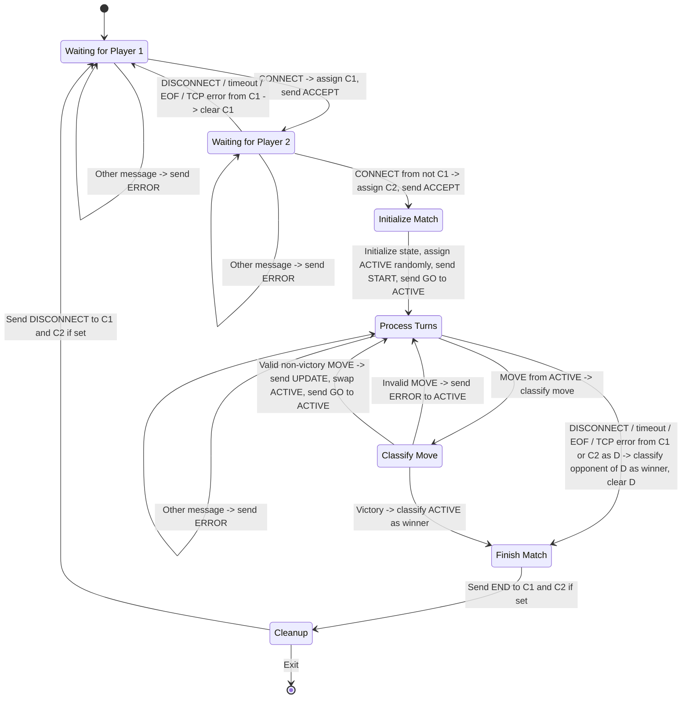
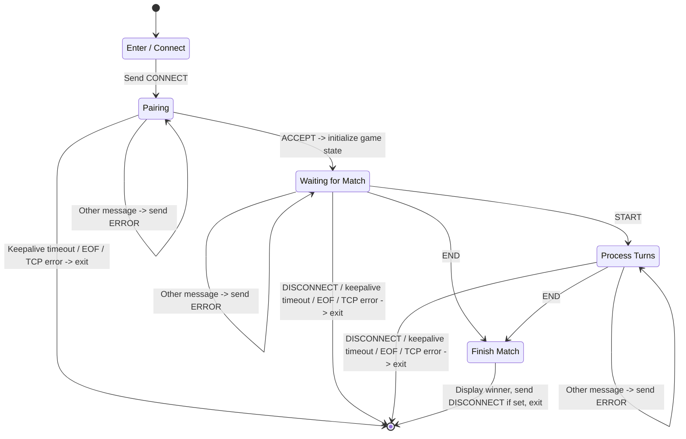

# Game State Machine (FSM) Design

## 2.3 Game Finite State Machine (FSM) Design

### Server-Side

Text

`WAIT_P1`:
- on `CONNECT`:
	- assign client to `C1`
	- respond `ACCEPT`
	- go to `WAIT_P2`
- on other message:
	- send `ERROR`

`WAIT_P2`:
- on tick:
	- send `KEEPALIVE` to `C1`
- on `CONNECT` from not `C1`:
	- assign client to `C2`
	- respond `ACCEPT`
	- go to `INIT`
- on `KEEPALIVE` from `C1`:
	- reset keepalive timer
- on other message:
	- send `ERROR`
- on `DISCONNECT` from `C1` OR
- on keepalive timeout from `C1` OR
- on `EOF` from `C1` OR
- on TCP error from `C1`:
	- clear `C1`
	- go to `WAIT_P1`

`INIT`:
- initialize game state
- assign `ACTIVE` to `C1` or `C2` at random
- send `START` to `C1` and `C2`
- send `GO` to `ACTIVE`
- go to `TURN`

`TURN`:
- on tick:
	- send `KEEPALIVE` to `C1` and `C2`
- on `MOVE` from `ACTIVE`:
	- go to `CLASSIFY`
- on other message:
	- send `ERROR`
- on `DISCONNECT` from `C1` or `C2` as `D` OR
- on keepalive timeout from `C1` or `C2` as `D` OR
- on `EOF` from `C1` or `C2` as `D` OR
- on TCP error from `C1` or `C2` as `D`:
	- classify opponent of `D` as winner
	- clear `D`
	- go to `FINISH`

`CLASSIFY`:
- if invalid:
	- send `ERROR` to active
	- go to `TURN`
- if victory:
	- classify `ACTIVE` as winner
	- go to `FINISH`
- otherwise:
	- send `UPDATE` to `C1` and `C2`
	- swap `ACTIVE`
	- send `GO` to `ACTIVE`
	- go to `TURN`

`FINISH`:
- send `END` to `C1` and `C2` if set
- go to `CLEANUP`

`CLEANUP`:
- if `EXIT`:
	- exit
- otherwise:
	- send `DISCONNECT` to `C1` and `C2` if set
	- go to `WAIT_P1`

### Client-Side

Text

`ENTER`:
- send `CONNECT` to server
- go to `PAIR`

`PAIR`:
- on `ACCEPT`:
	- initialize game state
	- go to `WAIT`
- on other message:
	- send `ERROR`
- on keepalive timeout from server OR
- on `EOF` from server OR
- on TCP error from server:
	- exit

`WAIT`:
- on tick:
	- send `KEEPALIVE` to server
- on `START` from server:
	- go to `TURN`
- on `END` from server:
	- go to `FINISH`
- on `KEEPALIVE` from server:
	- reset keepalive timer
- on other message:
	- send `ERROR` to server
- on `DISCONNECT` from server OR
- on keepalive timeout from server OR
- on `EOF` from server OR
- on TCP error from server:
	- exit

`TURN`:
- on tick:
	- send `KEEPALIVE` to server
- on `GO` from server:
	- prompt user for move
	- send `MOVE` to server
	- go to `TURN`
- on `ERROR from server`
	- warn user
	- go to `TURN`
- on `UPDATE`
	- update game state
	- go to `TURN`
- on `END`:
	- go to `FINISH`
- on `KEEPALIVE` from server:
	- reset keepalive timer
- on other message:
	- send `ERROR` to server
- on `DISCONNECT` from server OR
- on keepalive timeout from server OR
- on `EOF` from server OR
- on TCP error from server:
	- exit

`FINISH`:
- display winner
- send `DISCONNECT` to server if set
- exit

### Disconnects

C exposes TCP exceptions through negative returns plus `errno`.

Graceful disconnects (`DISCONNECT` messages) and abrupt terminations (timeouts, EOF, and exceptions) are handled by the same disconnect logic in the FSM. Client-side disconnects from the server are treated as program failures, while server-side disconnects from a client are either treated as recoverable (while waiting for connections) or forfeits (during gameplay).

To handle exceptions and disconnects through `recv`, the read-loop must handle negative and zero lengths as connection terminations.